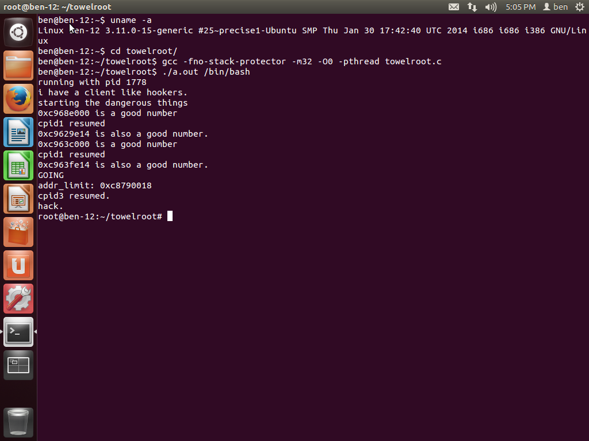

towelroot
=========

Research of CVE-2014-3153 and its famous exploit towelroot on IA (x86)

This job has DONE, but I can't leak the code, someone in my company has challenged me :(



## Compile
```
 gcc -fno-stack-protector -m32 -O0 -pthread towelroot.c -o towelroot
```

## References
+ https://github.com/geekben/towelroot

