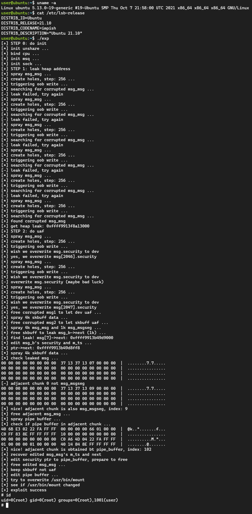

# CVE-2022-25636 pipe version

Using pipe-primitive  to exploit CVE-2022-25636, so no kaslr leak nor smap smep ktpi bypass is needed :)

(Q: What is pipe-primitive? A: https://github.com/veritas501/pipe-primitive)

